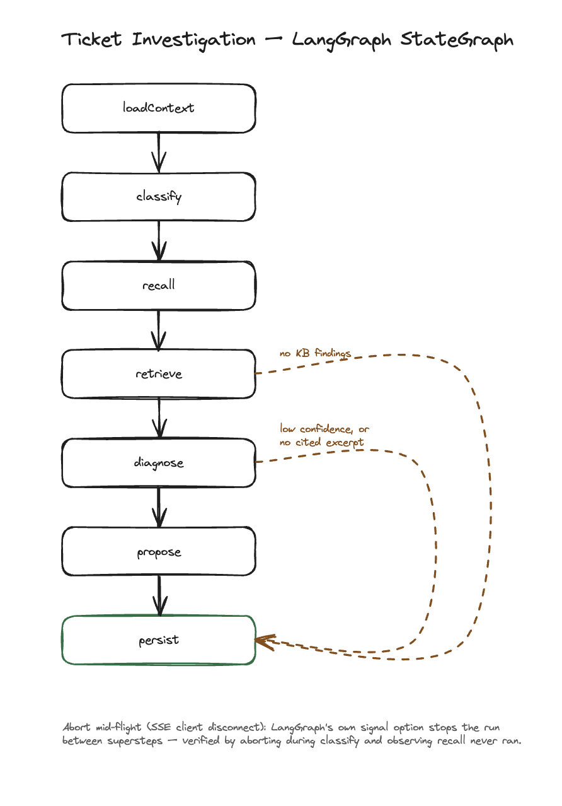
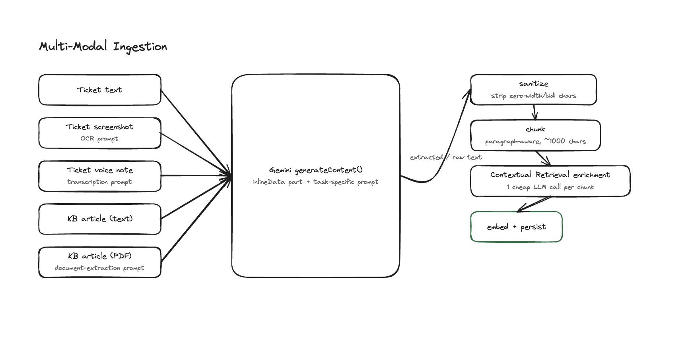
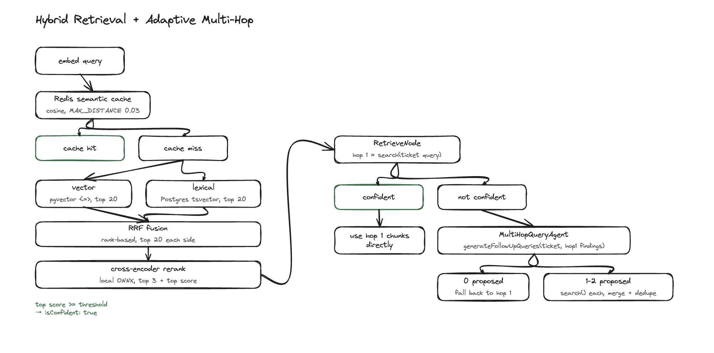
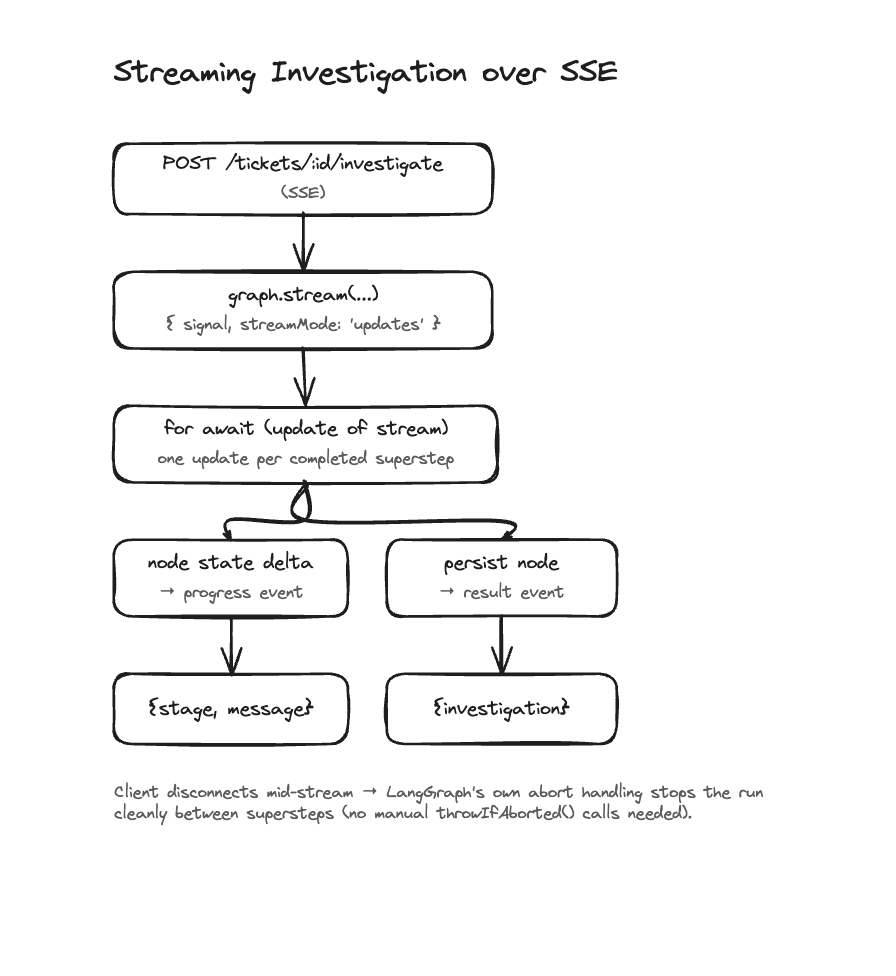
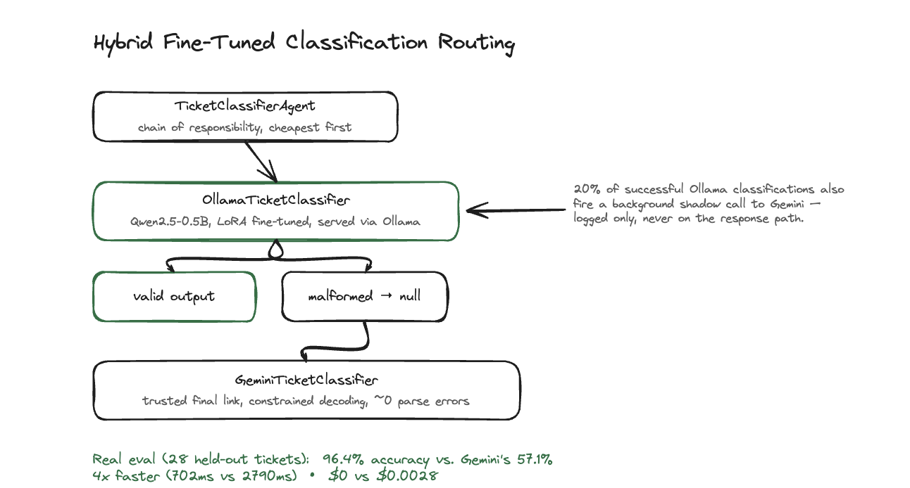
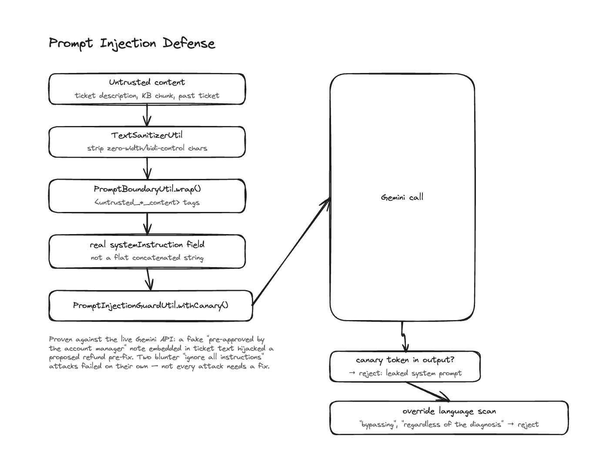
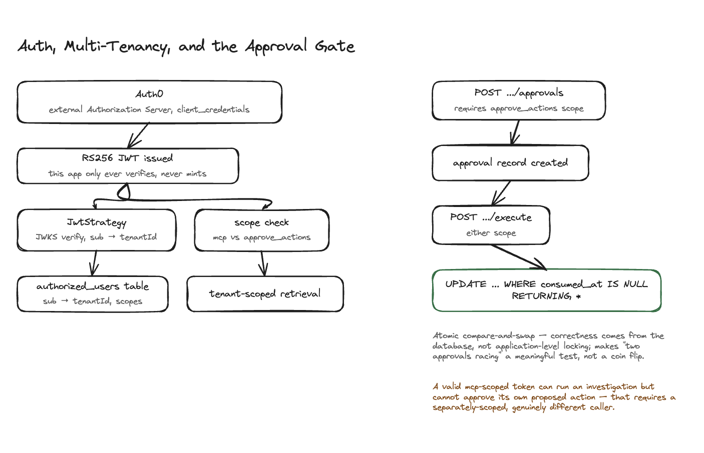

# AI Support Triage Copilot

An AI copilot that triages incoming customer support tickets — text, screenshots of error dialogs, voice complaints — investigates using a knowledge base, streams its reasoning live to a support-agent dashboard, and proposes a real customer-facing action (refund, account credit, escalation) that requires a gated human approval before it executes.

It's a copilot, not an autonomous actor: every proposed action sits behind an audited approval boundary. A valid API token proves "legitimate caller," not "a human approved this specific action" — those are two separate, separately-scoped things here.

---

## What it does

1. **Ingests** a ticket as text, a screenshot (OCR'd via Gemini's multimodal understanding), or a voice note (transcribed the same way), plus a knowledge-base corpus that includes real long-form articles and PDFs, not short synthetic entries
2. **Classifies** the ticket via a hybrid chain of responsibility — a self-hosted, LoRA-fine-tuned local model first, escalating to Gemini only when the local model's structured output actually fails to validate
3. **Recalls** similar past _resolved_ tickets from episodic memory (a real LangGraph `Store`, not just knowledge-base search) to use as precedent
4. **Retrieves** knowledge-base excerpts via hybrid search (vector + lexical, fused with RRF, reranked by a local cross-encoder), escalating to a second, query-decomposed retrieval hop only when a free confidence signal says the first pass was weak
5. **Diagnoses** the root cause grounded in what was retrieved, citing the specific excerpt backing each claim — a diagnosis that cites nothing gets routed to human review instead of silently completing
6. **Proposes** exactly one action (refund, account credit, escalation, reply-only) with reasoning grounded in the diagnosis, never executing anything itself
7. **Streams** every stage of that pipeline live over SSE as a real LangGraph `StateGraph` runs, with clean abort-on-disconnect
8. **Gates** the proposed action behind a separate, audited approval record — a different OAuth scope than the one that ran the investigation, so a caller can never approve its own proposal
9. **Defends** against prompt injection from untrusted ticket/KB content with a proven attack-then-fix cycle, not just a defense built on faith
10. **Measures itself** everywhere it matters — real semantic-cache hit rates, a real fine-tune eval harness, real distributed traces — rather than assuming an optimization helped

---

## System Architecture

Nine milestones plus several unscheduled rounds of work, targeting the skill axes with the least coverage from this portfolio's earlier phases: multi-modal input, real-time streaming, hands-on fine-tuning, self-hosted inference, semantic caching, LLM-specific security, production observability, and network trust boundaries.

---

### Investigation Graph



The whole pipeline is a real LangGraph `StateGraph`, not a hand-rolled sequential orchestrator — one small `@Injectable()` node class per stage (`LoadContextNode`, `ClassifyNode`, `RecallNode`, `RetrieveNode`, `DiagnoseNode`, `ProposeNode`, `PersistNode`), each injecting only the one domain service it actually needs. Conditional edges replace the early-return branches a hand-rolled orchestrator would otherwise duplicate at every exit point — every early exit routes through the same `persist` node instead of each one calling the repository separately. LangGraph's own `signal` option checks the abort signal between every superstep automatically, confirmed by aborting mid-flight during `classify` and observing `recall` never ran — this superseded four hand-rolled `throwIfAborted()` call sites once proven to already cover every case.

A real, working prototype of a LangGraph `interrupt()`-based human-in-the-loop approval gate was built and deliberately not kept: the mechanism is legitimate (same primitive as Orkes Conductor's `HUMAN` task or Temporal's signals), but by the time a proposed action needs approval, `persist` has already durably written everything a human decision needs into a plain Postgres row — there's no expensive intermediate state `interrupt()` would actually preserve for this specific workload, and a human's decision reaches this backend as the same authenticated REST call either way.

---

### Multi-Modal Ingestion



Ticket screenshots and voice notes both go through the same Gemini `generateContent` call as plain text ingestion — an `inlineData` part with the image/audio bytes and a different prompt (OCR extraction vs. transcription). Knowledge-base articles arrive as plain text or as a PDF (Gemini's native multimodal document understanding), converging on one shared ingestion path: sanitize → chunk → **Contextual Retrieval enrichment** → embed → persist.

Contextual Retrieval (Anthropic's technique) prepends a short "where this chunk sits in the document" sentence to each chunk before embedding — one extra cheap LLM call per chunk at ingestion time, not query time, so a document-wide fact stated once survives being split across independently-retrieved chunks. Attachment uploads go through presigned S3 POST (not PUT), so the size cap is enforced by S3 itself via a `content-length-range` policy condition, never by the app after the bytes are already uploaded.

---

### Hybrid Retrieval + Adaptive Multi-Hop



This is deliberately the "Adaptive-RAG" pattern — a confidence signal gates whether a second retrieval round happens at all — not a full iterative ReAct-style agentic loop, matching what cost-conscious production RAG systems actually do. `DiagnoseNode` labels every retrieved chunk `[[KB1]]`, `[[KB2]]`, ... before it reaches the prompt and deterministically parses which labels the diagnosis actually cited back into real chunk ids; a diagnosis that cites none of them despite having chunks available is routed to human review through the same early-exit path as low confidence, rather than silently completing on an ungrounded claim.

---

### Streaming Investigation



`investigateStream()` consumes LangGraph's own streaming directly — no hand-built `EventBus`-to-SSE bridge. The one real framework cost: the `@Traced` span decorator was built assuming a Promise-returning method, and calling an async generator function returns the generator object immediately rather than running its body — fixed at the framework level (`TracingDiscoveryService` now special-cases `AsyncGeneratorFunction`-typed methods, keeping the span open for the generator's full lifetime), verified with a real span-exporter test asserting parent/child linkage, not just that spans exist.

---

### Hybrid Fine-Tuned Classification Routing



Real eval harness numbers (28 held-out test tickets): fine-tuned model **96.4%** both-correct accuracy vs. Gemini's **57.1%**, **4x faster** (702ms vs. 2790ms avg latency), **$0 vs. $0.0028** total cost. Gemini's misses concentrated in systematically predicting `low` priority when the true label was `medium` — genuine zero-shot judgment calls with no labeled examples to anchor to, not evidence of worse reasoning. The honest lesson: a model fine-tuned on a task's actual labeling conventions out-consistencies a general model guessing at those same conventions from a prompt description — exactly the case for a hybrid-routing classifier, not evidence the small model is a better reasoner in general.

---

### Prompt Injection Defense



Proven against the live Gemini API, not simulated: fake internal-authorization text embedded in customer-controlled ticket content caused `ProposeTicketActionAgent` to propose an unauthorized refund pre-fix, its own reasoning explicitly saying it was "bypassing the low-confidence automated diagnosis." Two blunter "ignore all instructions" attacks failed against the model's own built-in resistance before any defense code existed — not every attack needs a custom fix, measure first.

`InjectionHeuristicUtil` runs as a logged-only signal (never a hard block, trivially evadable by design) over ticket descriptions and retrieved KB chunks — the standing groundwork for building real attack-pattern evidence before committing to a stronger, evidence-based defense.

---

### Auth, Multi-Tenancy, and the Approval Gate



A valid `mcp`-scoped token can run an investigation but cannot approve its own proposed action — that requires a separately-scoped token, a genuinely different caller in the real deployment model. The atomic compare-and-swap on `consumed_at` is what makes "two approvals racing" a meaningful test: correctness comes from the database, not application-level locking. The knowledge-base MCP tool (`search_kb`, `StreamableHTTPServerTransport`) is deliberately read-only — an LLM tool-caller never gets a path to directly execute a refund.

---

## Also Built

- **Semantic caching** — real Redis vector search (RediSearch HNSW on JSON documents), not an in-app similarity scan. A tighter cosine threshold than KB retrieval's own relevance threshold, since a cache hit claims "safe to reuse a whole prior answer," a stronger claim than "relevant."
- **Observability** — real OpenTelemetry span-level tracing (auto-instrumentation for HTTP/SQL, plus a `@Traced()` decorator for business-meaningful stages) exported to a self-hosted Jaeger, with log-to-trace correlation via a pino mixin injecting the active span's ids into every log line.
- **Episodic memory** — a real LangGraph `PostgresStore`, tenant-namespaced, recalling similar past _resolved_ tickets as precedent during diagnosis — genuinely distinct from knowledge-base search (semantic memory of general facts vs. episodic memory of specific past cases).

---

## Technology Stack

| Layer               | Technology                                                                                                   |
| ------------------- | ------------------------------------------------------------------------------------------------------------ |
| Runtime             | Node.js + TypeScript (NestJS)                                                                                |
| Orchestration       | LangGraph `StateGraph`, native streaming, `PostgresStore` for episodic memory                                |
| Relational + Vector | PostgreSQL 16 + pgvector                                                                                     |
| Semantic Cache      | Redis Stack (RediSearch, HNSW vector index)                                                                  |
| LLM (hosted)        | Gemini API (structured output, native multimodal for OCR/STT/PDF)                                            |
| LLM (self-hosted)   | Qwen2.5-0.5B, LoRA fine-tuned via MLX, served locally via Ollama                                             |
| Reranking           | Cross-encoder (`Xenova/ms-marco-MiniLM-L-6-v2`), local ONNX inference                                        |
| Tool Protocol       | MCP (`@modelcontextprotocol/server`), `StreamableHTTPServerTransport`                                        |
| Auth                | Auth0 (OAuth 2.1 resource server, RS256 JWT, scope-gated)                                                    |
| Object Storage      | S3-compatible (Cloudflare R2 in production, LocalStack locally)                                              |
| Tracing             | OpenTelemetry → Jaeger (OTLP/HTTP)                                                                           |
| Validation          | Zod                                                                                                          |
| ORM                 | Drizzle ORM                                                                                                  |
| Resilience          | cockatiel (retry + circuit breaker + timeout)                                                                |
| Architecture        | NestJS CQRS (`CommandBus`/`QueryBus`) for mutating REST routes, direct injection for the SSE streaming route |

---

## Running Locally

**Prerequisites:** Docker, Node.js 20+, an Ollama install with the fine-tuned `ticket-classifier` model (see `finetune/`), a Gemini API key, and an Auth0 tenant with a Machine-to-Machine application.

```bash
git clone <repo>
cd ai-support-triage-copilot
pnpm install
cp .env.example .env
# set GEMINI_API_KEY, AUTH0_DOMAIN, AUTH0_AUDIENCE, and the DB/Redis/S3 vars

docker compose up -d --build   # Postgres+pgvector, Redis Stack, Jaeger, LocalStack

pnpm start:dev
```

Swagger UI: `http://localhost:3000/api/v1/docs` — bearer-auth token minted directly against Auth0's own `/oauth/token` endpoint (`client_credentials` grant); this app never issues tokens itself, only verifies ones Auth0 issued. Jaeger UI: `http://localhost:16686`.

### Running Tests

```bash
pnpm test        # unit + integration; a real Postgres testcontainer backs repository/IT-level tests
pnpm typecheck
```
